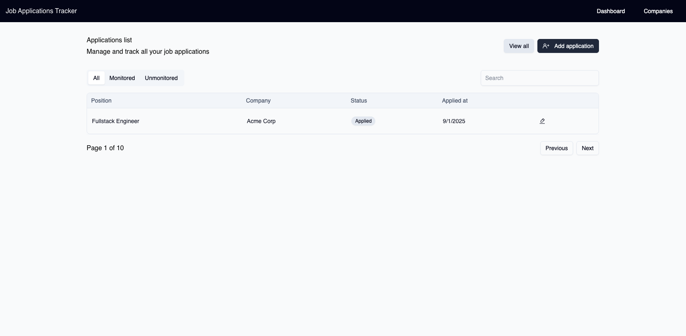

# 📌 Job Applications Tracker

Monorepo (simple structure) to manage the job application pipeline, divided into **modules**:

- **DB** (`/migrations`, `/scripts`): PostgreSQL with Docker, migrations, seeds, and validation scripts.
- **API** (`/api`): Spring Boot backend with entities, repositories, services, and controllers. Exposes REST endpoints and Swagger UI.
- **Web** (`/web`): React + Vite + Tailwind + Material Tailwind v3 application. Includes Redux Toolkit for global state and Axios for API requests.

---

## 🗂️ Project Structure

```
job-app-tracker/
├─ job-app-tracker-db/
│  ├─ migrations/           # SQL migrations
│  ├─ scripts/              # Bash scripts (migration, validation, backup, etc.)
├─ job-app-tracker-api/     # Spring Boot API
│  ├─ src/main/java/...     # Java source (entities, services, repos, controllers)
│  ├─ src/main/resources/   # Configs (application.yml, etc.)
│  └─ pom.xml               # Maven configuration
├─ web/                     # React + Vite + Tailwind + Material Tailwind
│  ├─ src/
│  │   ├─ components/       # Navbar, shared UI
│  │   ├─ features/         # Redux slices per domain (applications, etc.)
│  │   ├─ pages/            # Main views (Dashboard, Companies, etc.)
│  │   ├─ App.jsx
│  │   └─ main.jsx
│  ├─ tailwind.config.js
│  └─ package.json
├─ docs/
│  └─ images/               # Documentation assets (screenshots, diagrams)
├─ compose.yml              # Docker Compose (Postgres, optional pgAdmin)
├─ .env.example             # Environment variables
└─ README.md                # This file
```

---

## 🚀 Getting Started

### 1. Database (Postgres + Docker)
```bash
docker compose up -d
bash scripts/run_migration.sh   # apply migrations + seeds
bash scripts/validate_db.sh     # validate seeded data
```

### 2. Backend API (Spring Boot)
```bash
cd job-app-tracker-api
mvn spring-boot:run
```
Visit Swagger UI: [http://localhost:8080/swagger-ui.html](http://localhost:8080/swagger-ui.html)

### 3. Frontend (React + Vite + Tailwind)
```bash
cd web
npm install
npm run dev
```
Visit: [http://localhost:5173](http://localhost:5173)

---

## 📌 Features (current)
- **DB**  
  - Initial migrations (`application_status`, `companies`, `applications`)  
  - Basic indexes and validation with `EXPLAIN ANALYZE`  
  - Migration and validation scripts  

- **API**  
  - Spring Boot setup with base packages (`model`, `repository`, `service`, `controller`)  
  - Entities mapped to PostgreSQL schema (`Company`, `JobPosting`, `Application`, `ApplicationStatus`)  
  - JPA repositories and initial service layer  
  - Exposed `/api/statuses` and `/api/applications` endpoints  
  - Swagger UI available  

- **Web**  
  - Setup with Vite + Tailwind v3 + Material Tailwind v3  
  - Responsive Navbar with basic layout  
  - Redux structure with slices + thunks (Axios)  
  - Applications page: header, filters, table, pagination  
  - Connected to backend API  

---

## 📸 Preview



---

## 🔮 Next Steps
- [ ] Add CRUD endpoints for applications (create/update/delete).  
- [ ] Expand frontend with forms to add/edit applications.  
- [ ] Add OpenAI utility (e.g., auto-fill from Job Description).  
- [ ] Improve dashboard with metrics (cards, pipeline summary).  

---

# Notes 

- This is a personal portfolio project. External contributions are currently not accepted.

---

## 📜 Module Docs
- [Database Docs](./db/README.md) (migrations, seeds, scripts).  
- [API Docs](./api/job-app-tracker-api/README.md) (entities, endpoints, setup).  
- [Frontend Docs](./web/README.md) (setup and component guides).  

---

## ✅ License
MIT
